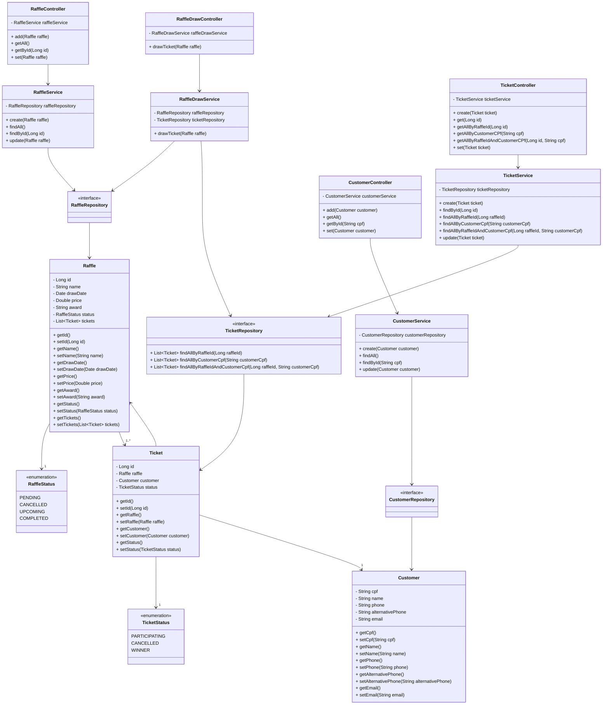

# Raffle API RESTful

### Desafio DIO Bootcamp
- **Desafio:** Desenvolver uma API RESTful com Spring Framework e Java
- **Tema:** A livre escolha
- **Bootcamp:** Desenvolvimento Java com IA

## Tecnologias utilizadas:
- Java 21 LTS
- Spring Boot 3.3.2
- Gradle - Groovy
- JPA
- H2 Database
- OpenAPI Swagger

## Detalhes do Projeto:
    API que armazena rifas, clientes, bilhetes e realiza o sorteio.

- ### Raffle: 
  - **Armazena e obtém os dados da rifa no Banco de Dados**
  - **ID** *(Gerado automaticamente pelo o banco de dados)*
  - **Name** *(Nome da Rifa, não é permitido nomes repetidos)*
  - **Date** *(Data e hora do sorteio)*
  - **Price** *(Valor da rifa)*
  - **Status** *(Pendente, Cancelado, A Realizar e Realizado)*
  - **Award** *(Prêmios a ser Ganhado)*
  - **Tickets** *(Contendo a lista de Bilhetes adqueridos)*

- ### Customer:
  - Armazena e obtém os dados do cliente no Banco de Dados
  - **CPF** *(Será a ID no banco de dados, portanto é obrigatório)*
  - **Name** *(Nome do cliente, é obrigatório)*
  - **Phone** *(Telefone, é obrigatório)*
  - **alternativePhone** *(Telefone alternativo, é pcional)*
  - **Email** *(Opcional)*

- ### Ticket:
  - Armazena e obtém os dados do bilhete no Banco de Dados
  - **ID** *(Gerado automaticamento pelo banco de dados)*
  - **Raffle** *(Pertencente)*
  - **Customer** *(Proprietário)*
  - **Status** *(Participando, Cancelado e Ganhador)*

- ### RaffleDraw:
  - Realiza o sorteio
  - Atualiza o Status da Rifa para Realizado
  - Atualiza o Status do Bilhete para Ganhador

## Progresso do Projeto:
- [x] Implementação do modelo `Customer`
- [x] Implementação do modelo `Raffle`
- [x] Implementação do modelo `Ticket`
- [x] Criação dos endpoints de CRUD para `Customer`
- [x] Criação dos endpoints de CRUD para `Raffle`
- [x] Criação dos endpoints de CRUD para `Ticket`
- [x] Implementação do H2 Database e Console
- [x] Testes de CRUD para `Raffle`
- [x] Testes de CRUD para `Customer`
- [x] Testes de CRUD para `Ticket`
- [x] Implementação da Documentação Swagger
- [x] Implementação do controlador `RaffleDraw`
- [x] Implementação do serviço `RaffleDraw`
- [ ] Configuração da validação de dados
- [ ] Tratamento das excessões
- [ ] Implementação de segurança com autenticação baseada em Token
- [ ] ~~Adição de testes unitários~~
- [ ] ~~Configuração do CI/CD~~

## Diagrama UML:

